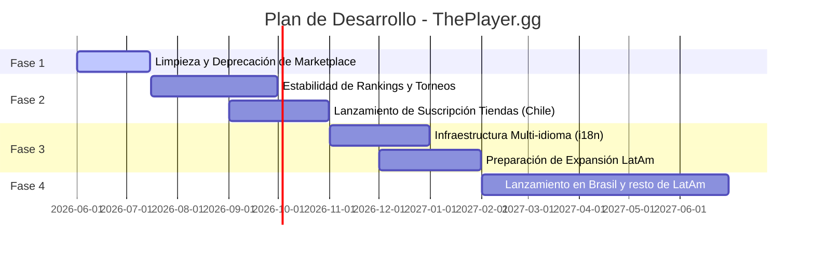

# Hoja de Ruta (Roadmap): ThePlayer.gg

Este documento detalla las fases clave del desarrollo y expansión de ThePlayer.gg para los próximos 12 meses.

---

## 📅 Resumen de Fases

---

## 🔍 Fases Detalladas

### Fase 1: Limpieza del Core y Retiro del Marketplace (Q3 2026 - Inicio)
**Objetivo:** Enfocar los recursos del equipo y simplificar la experiencia de usuario.
*   **Tareas Técnicas:**
    *   Eliminar vistas, rutas e integraciones de base de datos asociadas a transacciones de compra/venta de cartas.
    *   Optimizar el bundle inicial reduciendo dependencias obsoletas.
*   **Meta de Negocio:** Reducir la fricción operativa de soporte técnico para centrar los esfuerzos en el motor de ligas/torneos.

### Fase 2: Consolidación en Chile y Modelo de Suscripción (Q3-Q4 2026)
**Objetivo:** Estabilizar las características principales de TCG y comenzar a generar ingresos.
*   **Tareas Técnicas:**
    *   Refactorizar y optimizar la carga de archivos PDF y CSV de reportes de torneos.
    *   Optimizar las consultas a la base de datos de Supabase para calcular los Rankings y Player Points de forma instantánea.
    *   Integrar pasarela de pago (Stripe / Webpay) para habilitar el cobro automático de suscripciones de tiendas.
*   **Meta de Negocio:**
    *   Lanzar el Plan de Suscripción para Tiendas (cobro mensual).
    *   Implementar el "Sello de Torneo Oficial" que otorga puntaje directo a los rankings nacionales.

### Fase 3: Internacionalización y Preparación LatAm (Q4 2026 - Q1 2027)
**Objetivo:** Adaptar el software para múltiples mercados.
*   **Tareas Técnicas:**
    *   Implementar soporte completo para traducción multi-idioma (Español, Portugués, Inglés) mediante `LanguageContext` en toda la interfaz.
    *   Soportar múltiples zonas horarias y monedas para la creación de torneos.
*   **Meta de Negocio:** Hugo Castro inicia contactos y alianzas comerciales con tiendas de TCG y organizadores en Brasil y otros países de la región.

### Fase 4: Expansión Regional y Escalamiento (Q2 2027)
**Objetivo:** Posicionar a ThePlayer.gg como la plataforma de TCG líder en Latinoamérica.
*   **Tareas Técnicas:**
    *   Soporte para múltiples países en los rankings (filtro por país y ranking regional LatAm).
    *   Optimización de la CDN y latencias de base de datos para usuarios fuera de Chile.
*   **Meta de Negocio:** Adquisición masiva de tiendas en Brasil y México.
