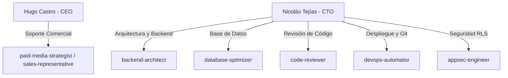

# Estructura del Equipo y Roles: ThePlayer.gg

Este documento detalla las funciones específicas de los miembros fundadores de la empresa y la asignación de tareas a los agentes de IA de apoyo.

---

## 👥 Estructura Humana (C-Level)

### 👑 Hugo Castro — Director Ejecutivo (CEO) y de Negocios
*   **Responsabilidades Primarias:**
    *   Negociación directa con tiendas y marcas patrocinadoras de TCG.
    *   Gestión de la comunidad, redes sociales y relaciones con los jueces oficiales.
    *   Búsqueda de oportunidades de crecimiento para la expansión internacional.
    *   Estructuración de planes comerciales y tarifas de suscripción.

### 💻 Nicolás Tejías — Director de Tecnología (CTO) y Desarrollo
*   **Responsabilidades Primarias:**
    *   Diseño y desarrollo de la arquitectura web de ThePlayer.gg.
    *   Implementación de flujos de código en React, TypeScript y base de datos Supabase.
    *   Garantizar el rendimiento técnico de la carga de torneos (procesadores CSV/PDF) y cálculo de rankings.
    *   Seguridad, optimización de base de datos y despliegue del software.

---

## 🤖 Mapeo de Agentes de IA de Apoyo

Para maximizar la eficiencia operativa del equipo, los agentes de IA se asocian de la siguiente manera:

### Agentes de Soporte Técnico (CTO Office)
1.  **`backend-architect` & `database-optimizer`:** Asisten a Nicolás en la creación de funciones de base de datos seguras (RPCs y triggers) para automatizar el cálculo del ranking oficial evitando sobrecostos de procesamiento.
2.  **`appsec-engineer`:** Realiza auditorías periódicas de las políticas de Row Level Security (RLS) en Supabase para evitar accesos no autorizados a datos de tiendas e historial de jugadores.
3.  **`devops-automator`:** Configura workflows de integración para asegurar que las pruebas de compilación pasen antes de subir cambios a Vercel.

### Agentes de Soporte Comercial (CEO Office)
1.  **`paid-media-strategist`:** Asiste a Hugo en la optimización del presupuesto de marketing de adquisición y diseño de pauta digital en redes.
2.  **`seo-specialist`:** Asegura que las páginas de tiendas y resultados de torneos estén optimizadas para buscadores (Google), incrementando el tráfico orgánico a la plataforma.
